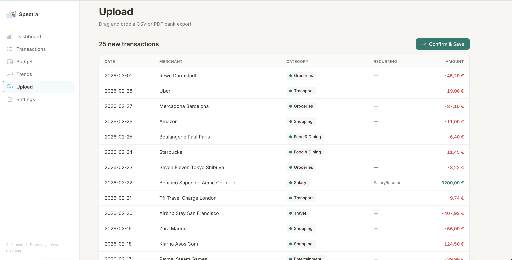
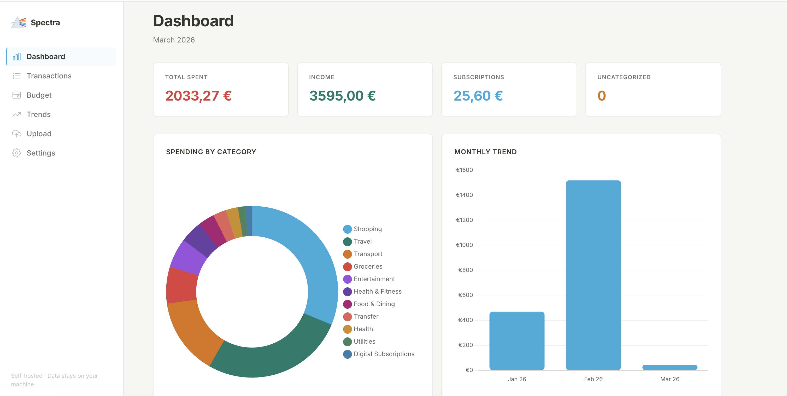
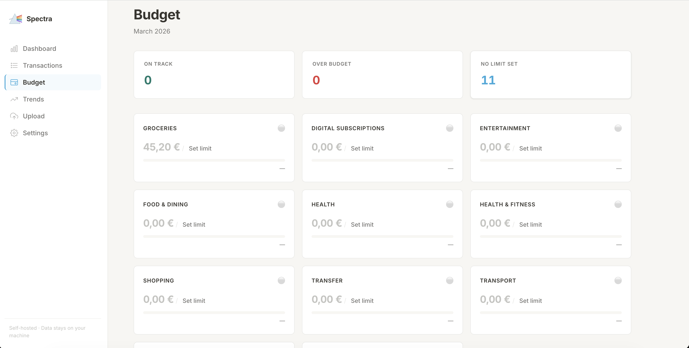
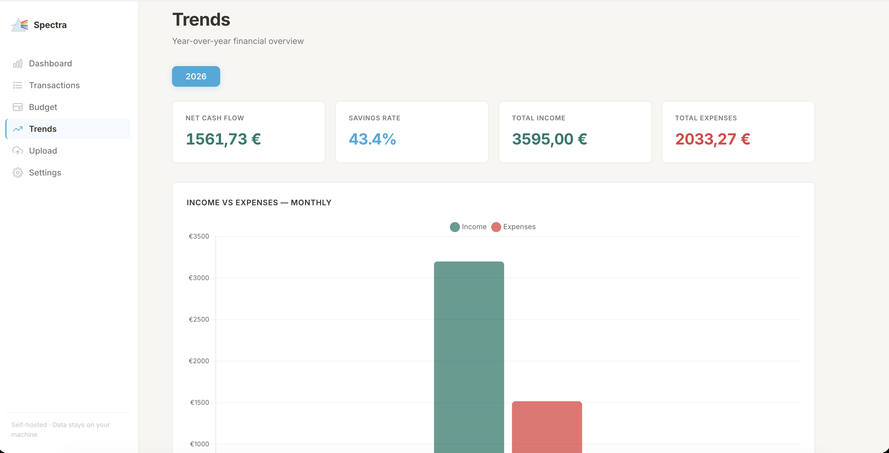

<p align="center">
  
</p>

<h1 align="center">Spectra</h1>

<p align="center">
  Local-first personal finance dashboard for bank exports.<br>
  Import CSV, PDF, or OFX files, review transactions, categorize them, and explore them in a local web UI.
</p>

<p align="center">
  
  
  
</p>

## What Spectra Does

Spectra is a self-hosted tool for people who want to manage personal finances without giving a third-party app direct access to their bank account.

You export your bank statement, import it into Spectra, review the transactions, and use the dashboard locally on your machine.

Main capabilities:

- Import bank exports in `CSV`, `PDF`, and `OFX`
- Normalize messy statement formats and deduplicate transactions
- Categorize transactions with `local`, `OpenAI`, or `Gemini` providers
- Review and correct imports before saving them
- Explore budgets, trends, recurring payments, and transaction history in a local web app
- Optionally sync outputs to Google Sheets

## Screenshots

| Dashboard | Transactions |
|---|---|
|  |  |

| Budget | Trends |
|---|---|
|  |  |

## How It Works

1. Export a statement from your bank.
2. Start Spectra locally.
3. Open `http://localhost:8080`.
4. Set your base currency in **Settings** if this is the first run.
5. Upload a `CSV`, `PDF`, or `OFX` file.
6. Review merchants and categories before importing.
7. Use the dashboard to inspect spending, budgets, trends, and recurring payments.

## Quick Start

There are two ways to run Spectra:

- `Docker`: best for most users
- `Native Python`: better for development

### Option 1: Run with Docker

#### Prerequisites

- Docker Desktop on macOS/Windows, or Docker Engine with Compose on Linux
- Docker daemon running

#### Step 1: Clone the repository

```bash
git clone https://github.com/francescogabrieli/Spectra.git
cd Spectra
```

#### Step 2: Start the app

macOS/Linux:

```bash
./spectra start --build
```

Windows PowerShell:

```powershell
.\spectra.ps1 start -Build
```

Windows CMD:

```cmd
spectra.cmd start -Build
```

#### Step 3: Open the app

Open `http://localhost:8080`.

#### Daily use

After the first build, you can usually start it without rebuilding:

macOS/Linux:

```bash
./spectra start
```

Windows PowerShell:

```powershell
.\spectra.ps1 start
```

Windows CMD:

```cmd
spectra.cmd start
```

#### Stop, logs, and status

macOS/Linux:

```bash
./spectra stop
./spectra logs
./spectra status
```

Windows PowerShell:

```powershell
.\spectra.ps1 stop
.\spectra.ps1 logs
.\spectra.ps1 status
```

Windows CMD:

```cmd
spectra.cmd stop
spectra.cmd logs
spectra.cmd status
```

#### Change the port

macOS/Linux:

```bash
./spectra start --port 3000 --build
```

PowerShell:

```powershell
.\spectra.ps1 start -Port 3000 -Build
```

CMD:

```cmd
spectra.cmd start -Port 3000 -Build
```

Then open `http://localhost:3000`.

### Option 2: Run with Native Python

#### Prerequisites

- Python `3.11+`
- [`uv`](https://docs.astral.sh/uv/)

#### Step 1: Clone the repository

```bash
git clone https://github.com/francescogabrieli/Spectra.git
cd Spectra
```

#### Step 2: Install dependencies

```bash
uv sync --locked
```

#### Step 3: Create a `.env`

Minimal local setup:

```env
AI_PROVIDER=local
```

Optional provider setup:

```env
# AI_PROVIDER=openai
# OPENAI_API_KEY=...

# AI_PROVIDER=gemini
# GEMINI_API_KEY=...
```

Optional Google Sheets sync:

```env
# SPREADSHEET_ID=...
# GOOGLE_SHEETS_CREDENTIALS_FILE=credentials.json
```

#### Step 4: Run the app

```bash
uv run python -m spectra --serve
```

Open `http://localhost:8080`.

## First Run Checklist

When Spectra starts for the first time:

1. Open **Settings**
2. Set your **Base Currency**
3. Upload a statement export
4. Review categories and merchants
5. Complete the import

This matters because currency conversion, budget tracking, and dashboard totals depend on the configured base currency.

## Configuration

### Categorization providers

Set `AI_PROVIDER` in `.env`:

- `local`: fully offline, no API key required
- `openai`: requires `OPENAI_API_KEY`
- `gemini`: requires `GEMINI_API_KEY`

The local mode combines:

- merchant memory stored in SQLite
- fuzzy matching for similar merchant names
- a local ML classifier trained from seed data and your corrections

### Google Sheets sync

Google Sheets is optional.

To enable it:

1. Create a Google Cloud project
2. Enable Google Sheets API and Google Drive API
3. Create a service account
4. Download the JSON credentials file
5. Share your target spreadsheet with the service account email
6. Set `SPREADSHEET_ID`
7. Set `GOOGLE_SHEETS_CREDENTIALS_FILE` or `GOOGLE_SHEETS_CREDENTIALS_B64`

## CLI Usage

These commands are useful if you want to process files without the web UI:

```bash
# Process a folder
uv run python -m spectra --inbox inbox/

# Preview without writing outputs
uv run python -m spectra --inbox inbox/ --dry-run

# Process a single file
uv run python -m spectra --file export.csv

# Run the dashboard on a custom port
uv run python -m spectra --serve --port 3000
```

## Project Structure

```text
src/spectra/           Application code
src/spectra/web/       FastAPI server, templates, static assets
tests/                 Automated tests
docs/                  Architecture, roadmap, repository notes
scripts/launchers/     Launcher implementations
tools/dev/             Developer utilities
```

Runtime data is stored locally in folders such as:

- `data/`
- `inbox/`
- `processed/`

By default the local SQLite database lives at `data/prism.db`.

## Privacy

- Spectra does not connect directly to your bank account
- Import, normalization, storage, and review happen locally
- In `local` mode, categorization is fully offline
- In `openai` or `gemini` mode, transaction data needed for categorization is sent to the selected provider

## Development

Install the dev environment:

```bash
uv sync --locked
```

Run the app:

```bash
uv run python -m spectra --serve
```

Run tests:

```bash
uv run pytest
```

See also:

- [CONTRIBUTING.md](CONTRIBUTING.md)
- [docs/architecture.md](docs/architecture.md)
- [docs/repository-layout.md](docs/repository-layout.md)
- [docs/roadmap.md](docs/roadmap.md)

## License

Spectra is licensed under the GNU Affero General Public License v3.0.

If you modify Spectra and run it as a network service, you must make the source code available under the terms of the license.

For commercial licensing, contact [francesco.gabrieli.fg@gmail.com](mailto:francesco.gabrieli.fg@gmail.com).
