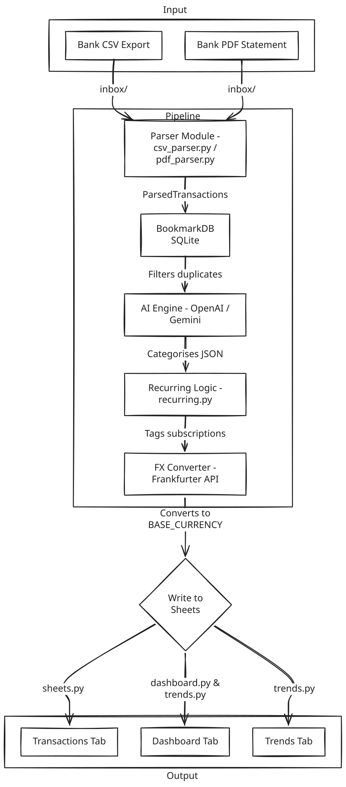

# Architecture

Spectra is organized around a local-first ingestion pipeline with an optional web UI and optional Google Sheets sync.

## Main layers

- `src/spectra/pipeline.py`: import orchestration and end-to-end processing.
- `src/spectra/csv_parser.py`, `pdf_parser.py`, `ofx_parser.py`: statement parsing and normalization.
- `src/spectra/local_categorizer.py`, `ml_classifier.py`, `rules.py`: categorization and rule application.
- `src/spectra/db.py`: SQLite persistence layer.
- `src/spectra/web/server.py`: local FastAPI dashboard and upload review flow.
- `src/spectra/sheets.py`: optional Google Sheets export.

## Data flow

1. Files enter via `inbox/` or the local web upload flow.
2. Parsers normalize transactions and generate stable IDs.
3. Rules and categorization engines assign merchants and categories.
4. Recurring detection and FX normalization enrich the dataset.
5. Results are written to SQLite, surfaced in the dashboard, and optionally exported to Google Sheets.

## Operational notes

- `data/`, `inbox/`, and `processed/` are runtime folders and should stay local.
- The root launchers are stable wrappers; implementation lives in `scripts/launchers/`.
- Documentation assets live under `docs/assets/` instead of the repository root.
